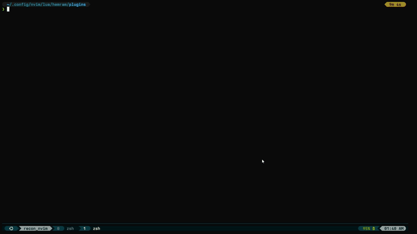

<div align="center">

# Recon.nvim

A Simple plugin to navigate files and execute commands in Neovim. 

</div>



## Installation
Install the plugin with your favorite package manager:

### Packer.nvim
```vim
Plug 'nvim-lua/plenary.nvim'
Plug 'nvim-telescope/telescope.nvim'
Plug 'h4-mm-3r/recon.nvim'
```

### Lazy.nvim
```lua
{
    "h4-mm-3r/recon.nvim",
    dependencies = {
        "nvim-lua/plenary.nvim",
        "nvim-telescope/telescope.nvim",
    },
    config = function()
        require("recon").setup()
    end,
    keys = function()
        -- set keymaps accordingly
    end
}
```

## Usage

### Marks
to mark a file,
```lua
:lua require("recon.mark").add_file()
```
to view all the marks of current buffer
```lua
:lua require("recon.ui").toggle_quick_menu()
```
to navigate to a mark
```lua
:lua require("recon.ui").nav_file(i) -- i is the index of the mark { set keymaps accordingly }
-- or 
:lua require("recon.ui").nav_next()
:lua require("recon.ui").nav_prev()
```

### Commands
to view all the commands of current buffer
```lua
:lua require("recon.cmd-ui").toggle_quick_menu()
```
to execute a command of index i
```lua
:lua require("recon.cmd-runner").run_recon_cmd(i) -- i is the index of the command { set keymaps accordingly }
```
> Note: Here Execution happens in the terminal buffer if there are no tmux panes. else it will be executed in the recent tmux pane.

## Telescope Extension
to add recon extenstion to telescope
```lua
{
    "nvim-telescope/telescope.nvim",
    config = function()
        require("telescope").setup({
        --    ... your configuration
        })
        --  ... your other extensions
        require("telescope").load_extension("recon")
    end
}
```

you get a new Mapping for `<C-h>` to add a file or smart select multiple files
to a Recon Marks Menu of current buffer

> Note: It only works for files based pickers of Telescope like find_files, git_files
> so, other pickers like live_grep, grep_string, etc. are not supported.

Inspired by harpoon by ThePrimeagen.
>>>>>>> 0d8fa0a (Update README.md)
>>>>>>> b1e5e50 (Update README.md)
